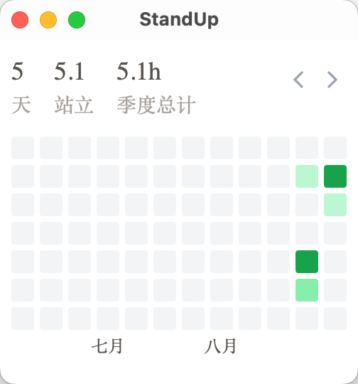

# StandUp[WIP]

统计站立办公时间的小 App，提供简单的统计视图



## Roadmap

- [x] 季度视图 + 滚动
- [x] 简单统计
- [x] 用户设置
- [x] 久坐/久站提醒
- [ ] ~~站立切换快捷键、Schema、Raycast 插件~~
- [ ] 单日视图
- [x] Import / Export
- [x] Github CI

## Development

### Prerequisite

- [Tauri environment](https://tauri.app/v1/guides/getting-started/prerequisites/)
- node > 20
- pnpm
- cargo

### Run

```
$ git switch -c dev origin/dev
$ pnpm i
$ pnpm tauri dev
```
